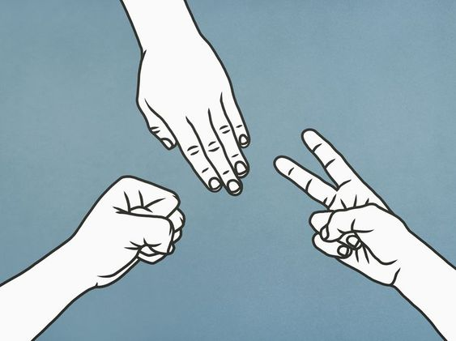

# Pedra, papel e tesoura

<div align = center>


>Este é um projeto destino para eu praticar meus conhecimentos utilizando um jogo antigo e popular.
</div>
<br>

### :dart: Ajustes e melhorias
O projeto ainda está em desenvolvimento e as próximas atualizações serão voltadas nas seguintes tarefas:
- [x] Versão jogável
- [ ] Permitir jogar novamente
- [ ] Bloquear resposta inválida
- [ ] Tornar o jogo mais visual

<br>

###  :partly_sunny: Tecnologias que pretendo utilizar no projeto
   

<br>

## ⚠️ Pré-requisitos
Antes de começar, verifique se você atendeu aos seguintes requisitos:
* Possuí a [última versão do git](https://git-scm.com/downloads).
* Possuí um [interpretador de python](https://www.python.org/downloads/) acima da versão 3.

<br>

## 💻 Instalação
Para baixar o código no windowns siga essas etapas:
1. Crie uma pasta vazia
2. Abra o prompt de comando dentro da pasta vazia
3. Insira o comando abaixo:
```console 
	git clone https://github.com/erikadias2004/pedra_papel_tesoura.git  .
```

<br>

## 🌱 Utilizando o código
1. Abra o arquivo no seu interpretador de python
2. Clique na tecla F5 para o código ser executado
3. Orientações de como jogar estão presentes no código.
